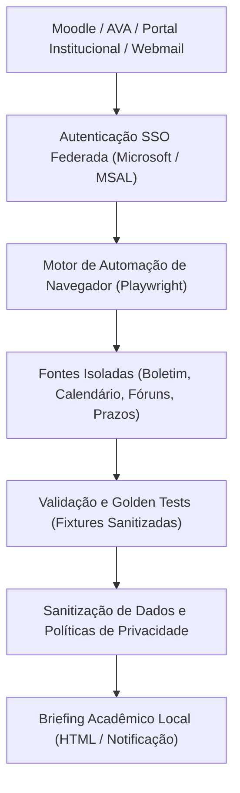
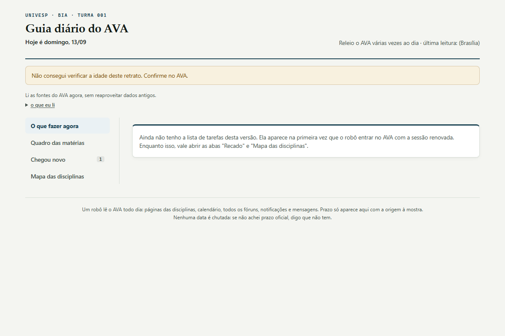

# Mentor UNIVESP

Automação de processos educacionais e consolidação de rotina acadêmica via Playwright para ambientes virtuais de aprendizagem sem API pública.

---

## Visão Geral

O **Mentor UNIVESP** é um projeto de automação desenvolvido para apoiar a gestão do tempo e o acompanhamento de prazos de um estudante universitário em curso de graduação a distância.

Ambientes Virtuais de Aprendizagem (AVAs baseados em Moodle), sistemas acadêmicos satélites e e-mails institucionais costumam manter informações dispersas, sem alertas proativos consolidados e sem APIs públicas de integração. Este projeto utiliza **Playwright** para navegar de forma resiliente por esses sistemas, extrair dados operacionais (prazos, fóruns, avaliações, materiais), validar a integridade dessas leituras e gerar um **briefing diário unificado** na máquina local do estudante.

---

## O Problema que Resolve

- **Informação dispersa em múltiplos sistemas:** o estudante precisava navegar manualmente entre o Moodle (AVA), o Portal do Aluno e o webmail institucional (Outlook) para descobrir tarefas pendentes.
- **Ausência de APIs:** as plataformas institucionais não fornecem endpoints públicos ou documentados para consulta de tarefas e notas.
- **Risco de perda de prazos:** atividades com janelas curtas de submissão ou regras específicas (como revisão entre pares em fóruns) podiam passar despercebidas.
- **Complexidade de autenticação:** fluxo protegido por SSO federado corporativo (Microsoft/Office 365), com telas anti-robô e expiração de sessão.

---

## Arquitetura da Automação

O pipeline opera por meio de etapas bem definidas, garantindo isolamento de falhas e proteção estrita da privacidade:



---

## Como a Automação Funciona

1. **Navegação com Playwright:** o motor acessa os sistemas web simulando a navegação do usuário autenticado. Ele trata explicitamente situações de transição, como carregamento assíncrono de componentes, avisos de tela cheia e sessões expiradas.
2. **Fontes Isoladas (*Fault Isolation*):** cada subsistema (boletim de notas, calendário de eventos, tópicos de fóruns, avisos gerais) é extraído por um módulo independente em `automacao/fontes/`. Se o portal de notas estiver temporariamente indisponível ou passar por manutenção, as outras fontes (fórum, prazos da semana) continuam funcionando normalmente. O sistema marca a fonte indisponível como `não confirmada` ou `falhou`, sem derrubar a execução e sem inventar dados.
3. **Resiliência e Recuperação:** retentativas defensivas para falhas transitórias de rede, sem insistir em requisições quando a sessão foi efetivamente encerrada pelo servidor.

---

## Privacidade e Proteção de Dados de Terceiros

A privacidade é uma restrição arquitetural essencial deste projeto:

- **Código versus Dados:** o repositório no GitHub armazena estritamente o código-fonte do motor e fixtures de teste sintéticas.
- **Bloqueio de Dados Reais no Git:** arquivos como `docs/data.json`, `docs/index.html` e `docs/estado.json` estão expressamente incluídos no `.gitignore`.
- **Proteção de Colegas e Docentes:** mensagens de fórum e interações com colegas contêm nomes e dados pessoais de terceiros. Nenhum desses dados é versionado, publicado ou enviado para servidores externos.
- **Credenciais Seguras:** credenciais de acesso nunca são gravadas em arquivos de código ou histórico.
- **Execução Local:** o briefing é gerado e consumido localmente na estação de trabalho do estudante.

---

## Demonstração Visual (Dados Sintéticos)

Exemplo de visualização do painel diário consolidado, gerado com dados de teste completamente sanitizados:



*Nota: Todas as notas, títulos de disciplinas e datas exibidas na imagem acima foram gerados a partir de fixtures de teste sintéticas para fins de demonstração.*

---

## Qualidade e Testes Automatizados

O repositório conta com **12 suítes de testes automatizados**, responsáveis por garantir que as heurísticas de extração e os cálculos de prazo permaneçam íntegros mesmo após mudanças de layout nos sistemas de origem:

| Suíte | Foco da Validação |
|---|---|
| `test_golden.py` | *Golden test* comparando a extração ponta a ponta contra snapshot de referência sanitizado. |
| `test_isolamento_fontes.py` | Garante que a falha de uma fonte não compromete os dados das demais. |
| `test_prazos.py` | Valida heurísticas de parsing de datas, carências e fusos horários. |
| `test_revisao_entre_pares.py` | Regras complexas de workshops e avaliações mútuas de estudantes. |
| `test_quadro.py` | Montagem da grade semanal e quinzenal de tarefas. |
| `test_operacao.py` | Políticas de publicação local, integridade de logging e guardrails de segurança. |
| Outras 6 suítes | Login simulado, workshop enviado, portal, fórum e webmail institucional. |

---

## Como Executar Localmente

### Pré-requisitos
- Python 3.10 ou superior.
- Navegadores do Playwright instalados.

### Instalação
```bash
git clone https://github.com/esdraaline/mentor-univesp-com170.git
cd mentor-univesp-com170
pip install -r automacao/requirements.txt
python -m playwright install chromium
```

### Executar os Testes
Para rodar a verificação de integridade e o teste golden (utilizando apenas fixtures sintéticas):
```bash
python testes/test_golden.py
python testes/test_isolamento_fontes.py
python testes/test_operacao.py
```

### Gerar o Briefing Localmente
```bash
# Execução local da coleta e montagem do briefing:
python automacao/gerar_guia.py
```

Não há execução agendada no GitHub: o painel e os dados são gerados na máquina do aluno (`python automacao/gerar_guia.py`) e nunca são publicados em repositório ou páginas públicas.

---

## Sobre o Desenvolvimento

Este projeto foi concebido como uma iniciativa pessoal e laboratório de aprendizagem em **automação de processos, integração de sistemas legados e resiliência de software**, buscando resolver um problema real de sobrecarga cognitiva e organização de estudos.

O desenvolvimento foi realizado com **apoio intensivo de ferramentas de Inteligência Artificial** para acelerar a escrita de scripts, geração de expressões regulares e estruturação das suítes de teste. O mapeamento dos fluxos de navegação, a modelagem dos estados de exceção, a política estrita de privacidade e a garantia de qualidade foram concebidos e guiados diretamente pelo autor.

---

## Status do Projeto

- **Fase:** Funcional em execução local assistida.
- **Segurança:** 100% livre de credenciais, cookies ou dados de terceiros no repositório.
- **Suítes de Teste:** 12 suítes de teste verdes.
